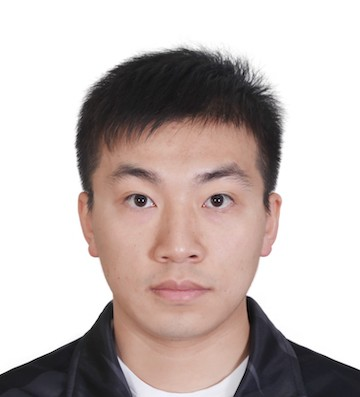

I am a 4th year Ph.D. student from the Department of Electrical Engineering at Princeton University, working with Prof. [Sharad Malik](https://www.princeton.edu/~sharad/). 
My research interest is to explore effective and efficient methods for modeling and verification of complex computing systems. Formal methods have been largely used in my research projects. My recent research project focuses on leveraging instruction-level hardware models in HW/SW co-simulation and Model-RTL tandem simulation.  

[CV](/files/cv.pdf) 
\[[Google Scholar](https://scholar.google.com/citations?user=gPszBPMAAAAJ&hl=en&oi=ao)] 
\[[GitHub](https://github.com/yuex1994)] 
\[[LinkedIn](https://www.linkedin.com/in/yue-xing-8b893810b/)]

## Publications

### Conferences

-   **_A Formal Instruction-Level GPU Model for Scalable Verification_**
    > **Yue Xing**, Bo-Yuan Huang, Aarti Gupta, and Sharad Malik  
    > International Conference on Computer-Aided Design (ICCAD), 2018 
    > \[[pdf](/files/iccad18.pdf)]

-   **_Approximate Adder with Hybrid Prediction and Error Compensation Technique_**
    > Xinghua Yang, **Yue Xing**, Fei Qiao, Qi Wei, Huazhong Yang   
    > IEEE Computer Society Annual Symposium on VLSI (ISVLSI), 2016 
    > \[[pdf](/files/isvlsi16.pdf)]

### Journals

-   **_Reducing NRE Labor Costs for Domain-Specific Architectures using Instruction-Level Abstractions_**
    > Bo-Yuan Huang, **Yue Xing**, Hongce Zhang, Huaixi Lu, Yi Li, Aarti Gupta, and Sharad Malik  
    > In submission to IEEE Micro.

-   **_Multistage Latency Adders Architecture Employing Approximate Computing_**
    > Xinghua Yang, **Yue Xing**, Fei Qiao, Huazhong Yang  
    > Journal of Circuits, Systems and Computers, 2017 
    > \[[pdf](files/jcsc17.pdf)]

## Experience

### Industrial

-   **Hardware Engineering Intern, Google.**
    Jun 2018 - Dec 2018, Mountain View, CA, USA 
    > Implemented Quantization framework to convert floating-point TensorFlow model to fixed-point model for edge-device applications
    > Developed end-to-end ML applications on domain specific accelerators
    > Explored runtime overhead and parallel algorithms to optimize the applications
    > Measured and characterized performance and power for the accelerators
    > Explored a simulator-based power model for the accelerators

-   **Research Intern, Intel Labs Beijing**
    Dec 2015 - Jun 2016, Beijing, China 
    > Explored architectural-level optimization for machine learning framework -- Hierarchical Temporal Memory Model.

### Teaching

-   **Head Lab Instructor**, ELE 206/COS 306 Contemporary Logic Design, Princeton University, Fall 2019
-   **Head Preceptor**, ELE 206/COS 306 Contemporary Logic Design, Princeton University, Fall 2019
-   **Lab Instructor**, ELE 206/COS 306 Contemporary Logic Design, Princeton University, Fall 2017
-   **Preceptor**, ELE 206/COS 306 Contemporary Logic Design, Princeton University, Fall 2017

### Mentoring

-   **Tinotenda Chinamora**
    > EE Department Undergrads Independent Project, Spring 2020   
    > Advisor: Prof. Sharad Malik  
    > Tandem Simulation between Instruction-level Abstraction (ILA) and Hardware Implementation (RTL)  

